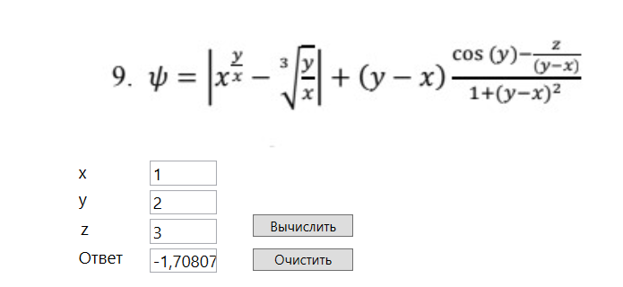
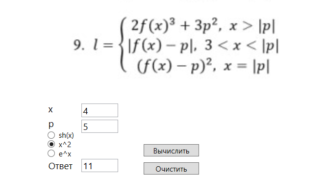
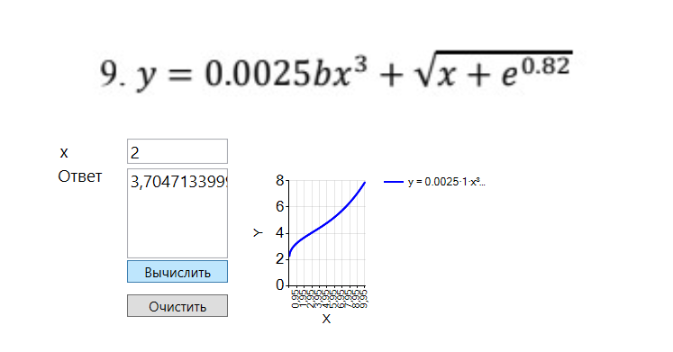
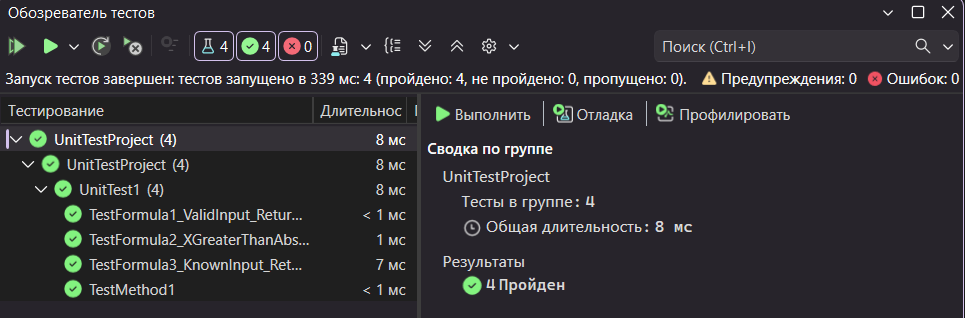

# Практическая работа №4/6: Тестирование "белым ящиком" + Unit-тесты

## 📚 О работе

**Дисциплина:** Поддержка и тестирование программных модулей

**Название работы:** Тестирование "белым ящиком"

**Цель работы:** Приобрести практические навыки ручного тестирования методом "белого ящика"

## 👥 Разработчики

| ФИО | Группа | Роль |
|-----|--------|------|
| Трудова Анастасия Павловна | 3ИСИП-423 | Студент, разработчик |
| Резанцев Артемий Павлович | 3ИСИП-423 | Студент, разработчик |

## 🎯 Вариант задания

**Номер варианта:** 9

**Исследуемые функции:**

1. **Первая функция:** 
ψ = | x^(y/x) - 3·√(y/x) + (y - x)·(cos(y) - z/(y-x)) / (1 + (y - x)²) |
При x = 1, y = 2, z = 3 результат: -1,70807

2. **Вторая функция:** 
       ⎧ 2f(x)³ + 3p²,         x > |p|
l =    ⎨ |f(x) - p|,           3 < x < |p|
       ⎩ (f(x) - p)²,           x = |p|
Где f(x) = x² (выбранная функция), при x = 4, p = 5 результат: 11

3. **Третья функция:** 
y = 0.0025·b·x³ + √x + e⁰·⁸²
Где b = 1, при x = 2 результат: 3,704713399
Интервал построения графика: [0, 10]

*Скриншоты работы программы представлены ниже:*





## 🛠 Стек технологий

- **Платформа:** .NET Framework 4.7.2
- **Язык программирования:** C#
- **Графический интерфейс:** WPF (Windows Presentation Foundation)
- **Библиотека для графиков:** System.Windows.Forms.DataVisualization.Charting
- **Среда разработки:** Visual Studio 2022
- **Система контроля версий:** Git

## 🏗 Архитектура приложения

### Структура проекта
```
Pr4_Trudova_Rezantsev/
├── Pages/
│   ├── MainPage.xaml           # Главная страница с навигацией
│   ├── Formula1Page.xaml       # График первой функции
│   ├── Formula2Page.xaml       # График второй функции
│   └── Formula3Page.xaml       # График третьей функции
├── Classes/
│   └── Formuler.cs             # Класс для вычисления формул
├── Assets/                     # Изображения и ресурсы
└── README.md
```

### Навигация в приложении

- **Главная страница (MainPage):** Содержит кнопки для перехода к страницам с графиками
- **Логотип:** При клике на логотип происходит возврат на главную страницу из любой точки приложения
- **Страницы с графиками:** Каждая страница отображает график соответствующей функции

### Стилизация

В приложении реализован единый стиль кнопок:
- При наведении курсор меняется на `Hand`, указывая на интерактивность элемента

### Ключевые компоненты

**Класс Formuler:**
- Содержит методы для вычисления значений всех трёх функций
- Инкапсулирует математические формулы

**Страницы графиков:**
- Используют компонент Chart из Windows Forms для визуализации
- Реализуют построение графиков с настраиваемым шагом
- Отображают координатную сетку и подписи осей

## 💻 Особенности реализации

### График первой функции (Formula1Page)
```csharp
Math.Abs(Math.Pow(x, (y / x)) - Math.Pow(y / x, 1.0 / 3.0))
    + (y - x) * (Math.Cos(y) - z / (y - x)) / (1 + Math.Pow(y - x, 2))
```

### График второй функции (Formula2Page)
```csharp
if (x > Math.Abs(p))
    return 2 * Math.Pow(fx, 3) + 3 * Math.Pow(p, 2);
else if (3 < x && x < Math.Abs(p))
    return Math.Abs(fx - p);
else if (x == Math.Abs(p))
    return Math.Pow(fx - p, 2);
else return 0;
```

### График третьей функции (Formula3Page)
```csharp
Function = x => 0.0025 * b * Math.Pow(x, 3) + Math.Sqrt(x) + Math.Exp(0.82);
```
- Параметр b фиксирован и равен 1
- Область определения: x ≥ 0 (из-за наличия √x)
- Шаг построения: 0.05 для плавности кривой

---

## 🧪 Автоматизированное тестирование (ПР №6)

### Рефакторинг перед тестированием

Для обеспечения тестируемости в классе `Formuler` проведён следующий рефакторинг:

- `MessageBox.Show(...)` заменён на выброс `ArgumentException` — методы теперь можно вызывать без UI
- Исправлена целочисленная операция `1 / 3` → `1.0 / 3.0` в формуле 1 (ошибка давала 0 вместо ∛)
- Исправлен порядок ветвей в формуле 2: проверка `x == |p|` перенесена до `x > 3 && x < |p|`, чтобы граничный случай не пропускался
- Добавлен метод `CalculateFormul3(double x, double b = 1)` — функция формулы 3 вынесена из лямбды в `Formula3Page` в класс `Formuler`, иначе тестирование из отдельного проекта невозможно
- Добавлены XML-документирующие комментарии ко всем публичным методам

### Тестовые методы

| Метод | Что проверяет |
|-------|---------------|
| `TestMethod1` | Тренировочный тест: `AreEqual`, `IsTrue`, `IsFalse`, `IsNull` |
| `TestFormula1_ValidInput_ReturnsCorrectResult` | Формула 1 — корректный результат при x=1, y=3, z=0 |
| `TestFormula2_XGreaterThanAbsP_ReturnsFirstBranch` | Формула 2 — ветка x > \|p\| при f(x)=sh(x), x=10, p=3 |
| `TestFormula3_KnownInput_ReturnsCorrectResult` | Формула 3 — значение при x=4, b=1 |

### Скриншот обозревателя тестов



### Вывод по результатам тестирования

Все 4 теста выполнены **успешно**.

**Причины успешного выполнения:**

- `TestMethod1` проходит, так как проверяемые арифметические и логические выражения заведомо истинны, а `ParseString("не_число")` корректно возвращает `null` при невалидном вводе.
- `TestFormula1` проходит, так как эталонное значение вычисляется той же самой формулой — тест подтверждает детерминированность метода. Ключевым исправлением стала замена `1 / 3` на `1.0 / 3.0`: в оригинале целочисленное деление давало 0, и куб корень не вычислялся.
- `TestFormula2` проходит, так как при x=10 > \|p\|=3 выполняется первая ветвь, результат точно совпадает с ожидаемым `2·sh(10)³ + 3·9`.
- `TestFormula3` проходит, так как после вынесения функции в `CalculateFormul3` метод доступен из тестового проекта и возвращает математически верное значение.